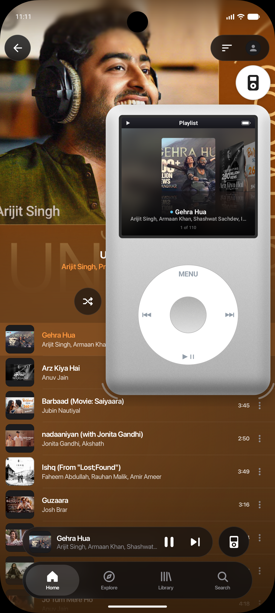
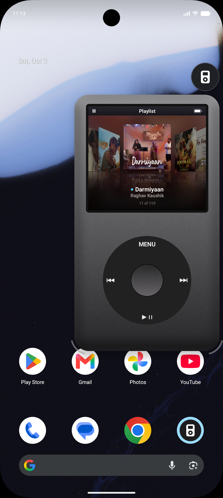
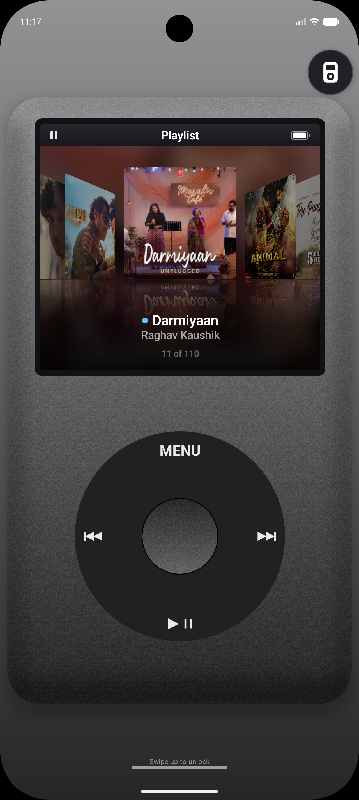

# iPodify

A click-wheel iPod that floats over any music app on Android, bringing retro iPod controls to whatever is playing:
Spotify, YouTube Music, Apple Music, SoundCloud, a podcast app, or anything with an active media session.

[](https://github.com/ShawAbhi/iPodify/releases/latest)
[](LICENSE)

## Previews

<div align="center">

| Works Over Any App (Light Mode) | Classic Dark Mode & Playlist Queue | Fullscreen Lock Screen Mode |
| :---: | :---: | :---: |
|  |  |  |
| **Works with almost any app**<br>Floating iPod over YouTube Music, Spotify, etc. | **Playlist queue & iPod controls**<br>Cover Flow playlist navigation in sleek dark mode | **Lockscreen integration**<br>Full-screen click-wheel control when enabled |

</div>

## Features

- **Works with almost any music app:** Seamlessly floats over and controls Spotify, YouTube Music, Apple Music, SoundCloud, podcasts, and more.
- **Iconic iPod Controls & Playlist Browsing:**
  - Spin the tactile wheel to browse through your queue and playlist.
  - Press the centre button to play the selected track.
  - **MENU** toggles between the playlist and Now Playing view.
  - Dedicated ⏮ ⏭ ⏯ playback buttons.
  - On Now Playing, spin the wheel to adjust volume; press the centre button to scrub through tracks.
- **Both Light & Dark Modes:** Features both the classic white/silver iPod aesthetic and sleek matte dark mode.
- **Cover Flow:** Visual queue display with artwork reflections and dynamic background blur.
- **Lock Screen Mode (Optional):** When enabled in settings, locking your phone opens the iPod full screen with swipe-to-unlock gesture support.
- **Floating Bubble & Resize:** Drag and fling to hide or dock at any screen edge. Resize the iPod by dragging either bottom corner or pinch to collapse.
- **Wheel Haptics:** Realistic tactile vibration feedback on every turn of the wheel (works even when system touch vibration is disabled).

## How it works

Android gives every music app a *media session*, which is what its notification and lock-screen controls talk to.
iPodify reads these sessions through **notification access**. That is the only way Android lets one app see and control another app's playback.

From the session that is playing, or the one that played most recently, iPodify mirrors:

- the track
- the artwork
- the progress
- the play state
- the queue, when the app shares it

Every control on the iPod is sent back to that app.

How much comes through depends on each app.

- **Every app:** the current track and play/pause/skip/seek.
- **Some apps:** the queue, or the artwork for the tracks in it. When an app doesn't share its queue, Cover Flow shows just the current track.

iPodify doesn't read your notifications, has no account, and sends nothing anywhere.

## Permissions

| Permission | What it's for |
| --- | --- |
| Notification access | To read and control other apps' media sessions. |
| Display over other apps | For the floating bubble and window. |
| Vibrate | For click-wheel haptics. |
| Internet | Only to load artwork that a player shares as a web link. |

On Android 13 and later, a sideloaded app's notification access can be greyed out as a *restricted setting*. To allow it, open iPodify's **App info**, tap **⋮**, choose **Allow restricted settings**, and then allow notification access.

## Building

Open the project in Android Studio, or run:

```
./gradlew installDebug
```

The minimum Android version is 8.0 (API 26).

## License

GPL-3.0. See [LICENSE](LICENSE). The iPod interface started out in [BitChord](https://github.com/kushagrasinghx/BitChord), a GPL-3.0 music player.

iPod is a trademark of Apple Inc. iPodify is an independent project and isn't affiliated with or endorsed by Apple.
